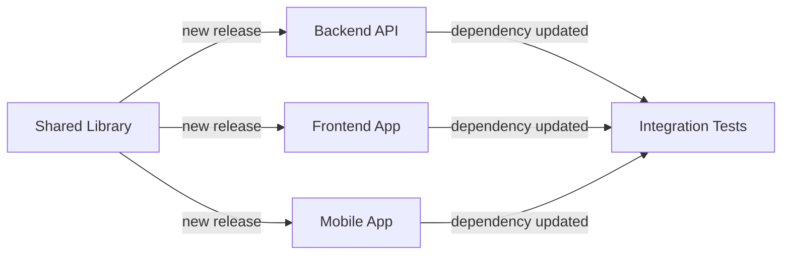

# 🔄 Repository Dispatch Integration

Dieses Dokument erklärt die Repository Dispatch Integration in diesem Projekt und wie sie verwendet wird.

## 📋 Inhaltsverzeichnis

- [Was ist Repository Dispatch?](#was-ist-repository-dispatch)
- [Unsere Implementation](#unsere-implementation)
- [Verfügbare Event Types](#verfügbare-event-types)
- [Verwendung](#verwendung)
- [Beispiele](#beispiele)
- [Konfiguration](#konfiguration)
- [Troubleshooting](#troubleshooting)

## Was ist Repository Dispatch?

Repository Dispatch ist ein GitHub Actions Feature, das es ermöglicht, Workflows in einem Repository über externe Events zu triggern. Es funktioniert wie ein "Remote-Trigger" für deine GitHub Actions.

### 🎯 Hauptvorteile:

- **Cross-Repository Workflows**: Ein Repository kann Workflows in anderen Repositories auslösen
- **External Integration**: Externe Systeme können GitHub Actions triggern
- **Flexible Orchestration**: Komplexe Deployment-Ketten zwischen verschiedenen Services
- **Event-Driven Architecture**: Reaktion auf Events statt zeitbasierte Triggers

### 🔄 Wie es funktioniert:

1. **Sender**: Sendet ein Repository Dispatch Event über die GitHub API
2. **GitHub**: Empfängt das Event und triggert entsprechende Workflows
3. **Empfänger**: Führt den Workflow basierend auf dem Event Type und Payload aus

## Unsere Implementation

Dieses Projekt enthält zwei Hauptkomponenten:

### 1. 📥 Repository Dispatch Handler (`repository-dispatch.yml`)

Empfängt und verarbeitet Repository Dispatch Events. Unterstützt verschiedene Event Types:

```yaml
on:
  repository_dispatch:
    types: 
      - deploy-staging
      - deploy-production
      - run-tests
      - sync-dependencies
      - custom-build
```

### 2. 📤 Repository Dispatch Sender (`dispatch-sender.yml`)

Sendet Repository Dispatch Events an andere Repositories:

```yaml
on:
  workflow_dispatch:    # Manuelle Auslösung
  workflow_run:         # Automatische Auslösung nach anderen Workflows
```

## Verfügbare Event Types

### 🚀 `deploy-staging`
Triggered ein Deployment zur Staging-Umgebung.

**Typischer Payload:**
```json
{
  "environment": "staging",
  "version": "v1.2.3",
  "deployment": {
    "type": "blue-green",
    "rollback_enabled": true
  }
}
```

### 🏭 `deploy-production`
Triggered ein Deployment zur Production-Umgebung.

**Typischer Payload:**
```json
{
  "environment": "production",
  "version": "v1.2.3",
  "deployment": {
    "type": "rolling",
    "requires_approval": true
  }
}
```

### 🧪 `run-tests`
Führt eine benutzerdefinierte Test-Suite aus.

**Typischer Payload:**
```json
{
  "test_config": {
    "coverage": true,
    "test_suite": "all",
    "browser_tests": {
      "enabled": true,
      "browsers": ["chrome", "firefox"]
    }
  }
}
```

### 📦 `sync-dependencies`
Synchronisiert Dependencies zwischen Repositories.

**Typischer Payload:**
```json
{
  "dependency_sync": {
    "source_repo": "org/source-repo",
    "update_type": "patch",
    "create_pr": true
  }
}
```

### 🔧 `custom-build`
Führt einen benutzerdefinierten Build-Prozess aus.

**Typischer Payload:**
```json
{
  "build_config": {
    "build_type": "production",
    "target_platforms": ["linux/amd64", "linux/arm64"],
    "optimization_level": "aggressive"
  }
}
```

## Verwendung

### 🛠️ 1. Mit dem Helper Script

Das mitgelieferte Script macht das Senden von Repository Dispatch Events einfach:

```bash
# Deployment zu Staging
./scripts/dispatch-helper.sh -r owner/target-repo -e deploy-staging

# Tests mit custom Payload
./scripts/dispatch-helper.sh -r owner/target-repo -e run-tests -p examples/payloads/run-tests.json

# Mit eigenem Token
GITHUB_TOKEN=ghp_xxxx ./scripts/dispatch-helper.sh -r owner/target-repo -e deploy-production
```

### 🌐 2. Über GitHub Actions UI

1. Gehe zu Actions → "Repository Dispatch Sender"
2. Klicke "Run workflow"
3. Fülle die Parameter aus:
   - **Target Repository**: `owner/repo`
   - **Event Type**: Wähle aus der Liste
   - **Environment**: `staging/production/etc.`
   - **Version**: `v1.2.3` oder `latest`

### 🔧 3. Über GitHub API

```bash
curl -X POST \
  -H "Accept: application/vnd.github.v3+json" \
  -H "Authorization: token $GITHUB_TOKEN" \
  https://api.github.com/repos/OWNER/REPO/dispatches \
  -d '{
    "event_type": "deploy-staging",
    "client_payload": {
      "environment": "staging",
      "version": "latest"
    }
  }'
```

### 📱 4. Über externe Systeme

Repository Dispatch kann von jedem System ausgelöst werden, das HTTP-Requests senden kann:

- **CI/CD Pipelines** (Jenkins, GitLab CI, etc.)
- **Monitoring Tools** (Prometheus AlertManager, etc.)
- **Chat Bots** (Slack, Teams, etc.)
- **Deployment Tools** (ArgoCD, Flux, etc.)

## Beispiele

### Beispiel 1: Einfaches Staging Deployment

```bash
./scripts/dispatch-helper.sh \
  -r myorg/frontend-app \
  -e deploy-staging
```

### Beispiel 2: Production Deployment mit custom Konfiguration

```bash
./scripts/dispatch-helper.sh \
  -r myorg/production-cluster \
  -e deploy-production \
  -p examples/payloads/deploy-production.json
```

### Beispiel 3: Multi-Repository Deployment

Nach einem erfolgreichen Release wird automatisch ein Deployment an mehrere Repositories getriggert:

```yaml
# In dispatch-sender.yml
strategy:
  matrix:
    target:
      - repo: 'myorg/frontend-app'
      - repo: 'myorg/backend-api'
      - repo: 'myorg/database-migrations'
```

### Beispiel 4: Dependency Update Chain



## Konfiguration

### 🔑 Required Secrets

Für Cross-Repository Dispatch Events benötigst du ein GitHub Token:

1. **GITHUB_TOKEN**: Automatisch verfügbar (nur für gleiches Repository)
2. **DISPATCH_TOKEN**: Personal Access Token mit `repo` scope (für andere Repositories)

#### Personal Access Token erstellen:

1. Gehe zu GitHub Settings → Developer settings → Personal access tokens
2. Klicke "Generate new token (classic)"
3. Wähle Scopes:
   - `repo` (für private Repositories)
   - `public_repo` (nur für öffentliche Repositories)
4. Füge das Token als Secret `DISPATCH_TOKEN` hinzu

### 🔧 Workflow Anpassungen

Du kannst die Workflows an deine Bedürfnisse anpassen:

#### Event Types erweitern:

```yaml
on:
  repository_dispatch:
    types: 
      - deploy-staging
      - deploy-production
      - your-custom-event  # Neu hinzufügen
```

#### Neue Jobs hinzufügen:

```yaml
your-custom-job:
  name: 🔧 Your Custom Job
  runs-on: ubuntu-latest
  if: github.event.action == 'your-custom-event'
  steps:
    # Deine Custom Logic
```

## Troubleshooting

### ❌ Häufige Probleme

#### 1. "Repository not found" oder "403 Forbidden"

**Ursache**: Fehlende Berechtigung oder falsches Token

**Lösung**:
- Überprüfe das Token (muss `repo` scope haben)
- Stelle sicher, dass der Repository-Name korrekt ist (`owner/repo`)
- Prüfe, ob das Token Zugriff auf das Ziel-Repository hat

#### 2. Workflow wird nicht getriggert

**Ursache**: Workflow-Datei nicht im default branch

**Lösung**:
- Repository Dispatch Events triggern nur Workflows im default branch
- Stelle sicher, dass die Workflow-Datei in `main` oder `master` committed ist

#### 3. "No more than 10 properties are allowed"

**Ursache**: Zu viele Top-Level Properties im client_payload

**Lösung**:
```json
// ❌ Falsch (zu viele Top-Level Properties)
{
  "prop1": "value1",
  "prop2": "value2",
  // ... 12 properties
}

// ✅ Richtig (wrapping in einem Object)
{
  "config": {
    "prop1": "value1",
    "prop2": "value2",
    // ... alle properties
  }
}
```

#### 4. Payload zu groß

**Ursache**: client_payload überschreitet GitHub-Limit

**Lösung**:
- Reduziere die Payload-Größe
- Verwende URLs statt inline Daten
- Teile große Payloads auf mehrere Events auf

### 🔍 Debugging

#### Workflow Debug Output aktivieren:

```bash
# In GitHub Repository Settings → Secrets
ACTIONS_STEP_DEBUG = true
ACTIONS_RUNNER_DEBUG = true
```

#### Event Details anzeigen:

```yaml
- name: Debug Event
  run: |
    echo "Event: ${{ toJson(github.event) }}"
    echo "Action: ${{ github.event.action }}"
    echo "Payload: ${{ toJson(github.event.client_payload) }}"
```

### 📊 Monitoring

Du kannst Repository Dispatch Events überwachen:

```yaml
- name: Log Event
  run: |
    echo "$(date): Repository Dispatch Event" >> dispatch.log
    echo "Action: ${{ github.event.action }}" >> dispatch.log
    echo "Sender: ${{ github.event.sender.login }}" >> dispatch.log
```

## Weiterführende Links

- 📖 [GitHub Repository Dispatch Documentation](https://docs.github.com/en/rest/repos/repos#create-a-repository-dispatch-event)
- 🛠️ [Peter Evans Repository Dispatch Action](https://github.com/peter-evans/repository-dispatch)
- 🔧 [GitHub Actions Workflow Syntax](https://docs.github.com/en/actions/using-workflows/workflow-syntax-for-github-actions)
- 🎯 [GitHub Actions Events](https://docs.github.com/en/actions/using-workflows/events-that-trigger-workflows)

---

**💡 Tipp**: Starte mit einfachen Anwendungsfällen und erweitere die Implementation schrittweise. Repository Dispatch ist sehr mächtig, aber auch komplex - plane deine Event-Architektur sorgfältig!
