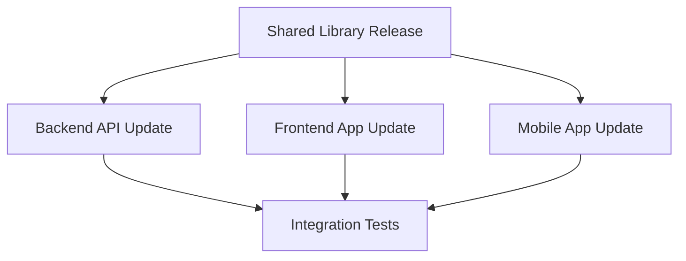

# 📋 Repository Dispatch Examples

Dieses Verzeichnis enthält praktische Beispiele für die Verwendung von Repository Dispatch in diesem Projekt.

## 📁 Verzeichnisstruktur

```
examples/
├── payloads/           # JSON Payload-Beispiele
│   ├── deploy-staging.json
│   ├── deploy-production.json
│   ├── run-tests.json
│   └── custom-build.json
└── README.md          # Diese Datei
```

## 🚀 Schnellstart

### 1. Grundlegende Verwendung

```bash
# Einfaches Staging Deployment
./scripts/dispatch-helper.sh -r owner/target-repo -e deploy-staging

# Mit GitHub Token
GITHUB_TOKEN=ghp_xxxx ./scripts/dispatch-helper.sh -r owner/target-repo -e deploy-production
```

### 2. Mit Payload-Dateien

```bash
# Deployment mit erweiterten Optionen
./scripts/dispatch-helper.sh \
  -r owner/frontend-app \
  -e deploy-staging \
  -p examples/payloads/deploy-staging.json

# Tests mit Browser-Konfiguration
./scripts/dispatch-helper.sh \
  -r owner/test-suite \
  -e run-tests \
  -p examples/payloads/run-tests.json
```

## 📝 Payload-Beispiele

### 🚀 Deployment Payloads

#### Staging Deployment
Siehe: [`payloads/deploy-staging.json`](payloads/deploy-staging.json)

Features:
- Blue-Green Deployment
- Automatische Rollback-Möglichkeit
- Slack-Benachrichtigungen
- Feature Flag Konfiguration

#### Production Deployment
Siehe: [`payloads/deploy-production.json`](payloads/deploy-production.json)

Features:
- Rolling Deployment
- Approval-Workflow
- Umfangreiche Überwachung
- Backup-Strategien

### 🧪 Test Payloads

#### Comprehensive Testing
Siehe: [`payloads/run-tests.json`](payloads/run-tests.json)

Features:
- Coverage-Analyse
- Browser-Tests (Chrome, Firefox, Safari)
- Performance-Tests
- Artefakt-Speicherung

### 🔧 Build Payloads

#### Custom Build Configuration
Siehe: [`payloads/custom-build.json`](payloads/custom-build.json)

Features:
- Multi-Platform Builds
- Sicherheits-Scans
- Layer-Caching
- SBOM (Software Bill of Materials) Generation

## 🎯 Anwendungsfälle

### 1. 🔄 Continuous Deployment Pipeline


**Implementierung:**
```bash
# Nach erfolgreichem Build im main branch
./scripts/dispatch-helper.sh \
  -r myorg/deployment-pipeline \
  -e deploy-staging \
  -p examples/payloads/deploy-staging.json
```

### 2. 🏗️ Multi-Service Orchestration



**Implementierung:**
```bash
# Trigger updates in allen abhängigen Services
./scripts/dispatch-helper.sh -r myorg/backend-api -e sync-dependencies
./scripts/dispatch-helper.sh -r myorg/frontend-app -e sync-dependencies
./scripts/dispatch-helper.sh -r myorg/mobile-app -e sync-dependencies
```

### 3. 🧪 On-Demand Testing

```bash
# Trigger spezifische Test-Suites
./scripts/dispatch-helper.sh \
  -r myorg/test-automation \
  -e run-tests \
  -p examples/payloads/run-tests.json
```

### 4. 🚨 Emergency Deployments

```bash
# Schnelles Hotfix-Deployment
./scripts/dispatch-helper.sh \
  -r myorg/production-cluster \
  -e deploy-production \
  -p <(echo '{"environment":"production","version":"hotfix-v1.2.4","deployment":{"type":"immediate"}}')
```

## 🔧 Anpassung der Payloads

### Eigene Payload erstellen

1. **Kopiere eine bestehende Payload-Datei:**
   ```bash
   cp examples/payloads/deploy-staging.json my-custom-payload.json
   ```

2. **Passe die Konfiguration an:**
   ```json
   {
     "environment": "my-environment",
     "version": "my-version",
     "my_custom_config": {
       "setting1": "value1",
       "setting2": true
     }
   }
   ```

3. **Verwende die neue Payload:**
   ```bash
   ./scripts/dispatch-helper.sh \
     -r owner/repo \
     -e my-event \
     -p my-custom-payload.json
   ```

### Umgebungsspezifische Payloads

```bash
# Development
cp examples/payloads/deploy-staging.json dev-payload.json
# Anpassen für Development-Umgebung

# Staging
cp examples/payloads/deploy-staging.json staging-payload.json
# Anpassen für Staging-Umgebung

# Production
cp examples/payloads/deploy-production.json prod-payload.json
# Anpassen für Production-Umgebung
```

## 🛠️ Integration mit anderen Tools

### CI/CD Integration

#### GitHub Actions
```yaml
- name: Trigger Deployment
  run: |
    ./scripts/dispatch-helper.sh \
      -r ${{ vars.DEPLOYMENT_REPO }} \
      -e deploy-staging \
      -p examples/payloads/deploy-staging.json
  env:
    GITHUB_TOKEN: ${{ secrets.DISPATCH_TOKEN }}
```

#### Jenkins
```groovy
pipeline {
    stages {
        stage('Deploy') {
            steps {
                sh '''
                    ./scripts/dispatch-helper.sh \
                      -r ${DEPLOYMENT_REPO} \
                      -e deploy-production \
                      -p examples/payloads/deploy-production.json
                '''
            }
        }
    }
}
```

### Monitoring Integration

#### Prometheus AlertManager
```yaml
- alert: HighErrorRate
  expr: error_rate > 0.1
  for: 5m
  annotations:
    webhook_url: |
      curl -X POST https://api.github.com/repos/OWNER/REPO/dispatches \
        -H "Authorization: token $GITHUB_TOKEN" \
        -d '{"event_type":"emergency-scale","client_payload":{"alert":"high_error_rate"}}'
```

## 📚 Weitere Ressourcen

- 📖 [Hauptdokumentation](../docs/REPOSITORY_DISPATCH.md)
- 🛠️ [Script-Dokumentation](../scripts/dispatch-helper.sh)
- 🔧 [Workflow-Dateien](../.github/workflows/)
- 🌐 [GitHub Repository Dispatch Docs](https://docs.github.com/en/rest/repos/repos#create-a-repository-dispatch-event)

## 💡 Best Practices

1. **Verwende aussagekräftige Event Names**: `deploy-staging` statt `deploy`
2. **Strukturiere Payloads konsistent**: Verwende einheitliche Schemas
3. **Validiere Payloads**: Prüfe kritische Parameter vor dem Senden
4. **Implementiere Monitoring**: Logge Events und Ergebnisse
5. **Dokumentiere Events**: Beschreibe Purpose und Usage jedes Event Types
6. **Teste Payloads**: Verwende Staging-Umgebungen für Tests
7. **Sichere Tokens**: Verwende Repository Secrets für GitHub Tokens

---

**🚀 Happy Dispatching!** 

Bei Fragen oder Problemen, siehe [Troubleshooting](../docs/REPOSITORY_DISPATCH.md#troubleshooting) in der Hauptdokumentation.
